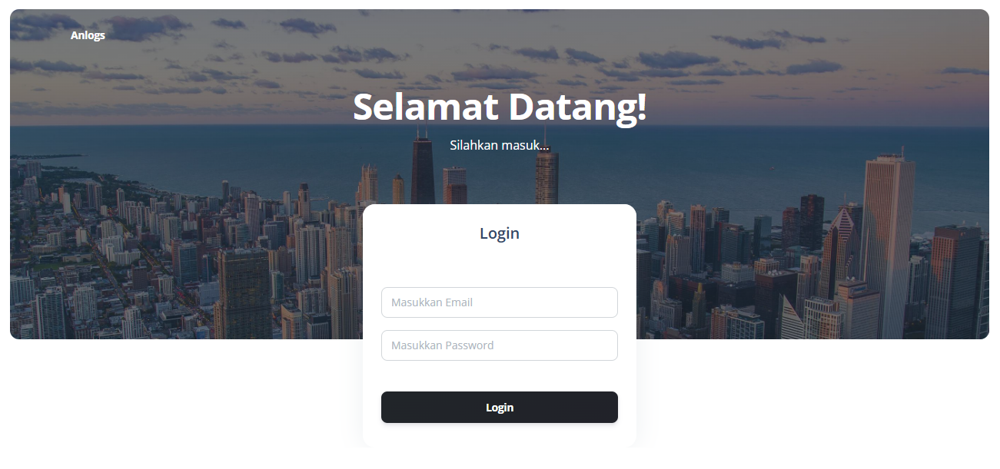
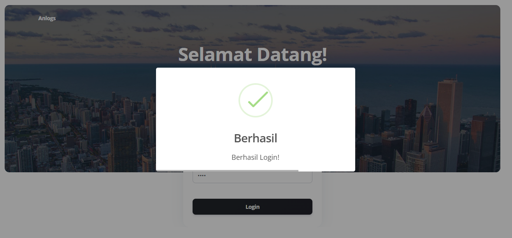
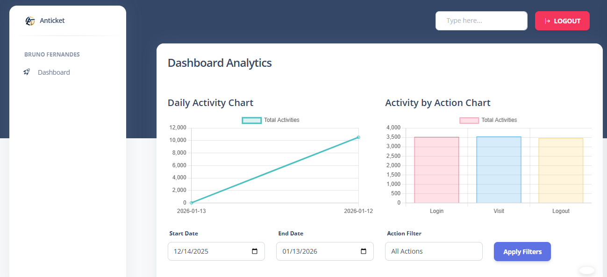
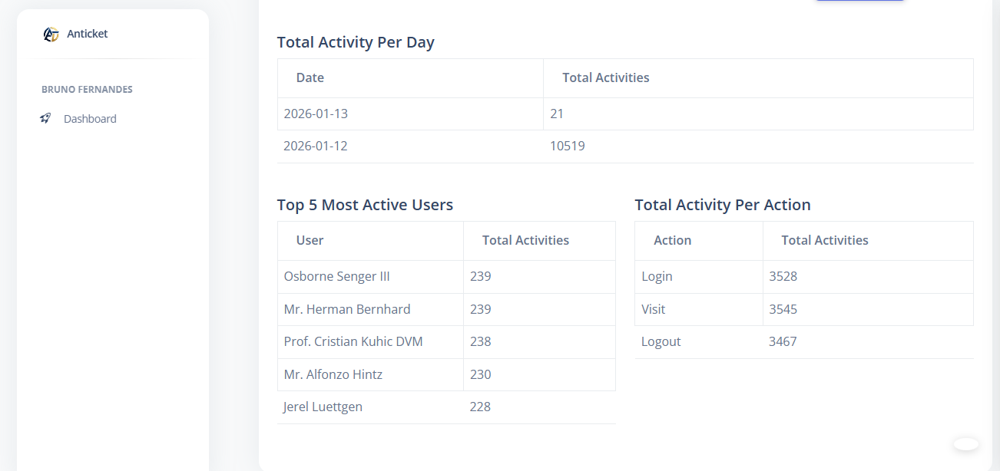

# Anlogs
Anlogs adalah system untuk track aktifitas user & analytics dashboard. Setiap langkah user akan di record. Data yg ter-record seperti action('login','logout','visit'), ip address, dan page.

## Stack

    
    
    
    

## Requirement
- PHP version > 8.2
- Laravel 12

## Config
- `composer install`
- `php artisan key:generate`
- `cp .env.example .env` (bila .env belum ada)
- buat database bernama anlogs
- `php migrate`
- `php artisan db:seed`
- `php artisan db:seed --class=UsersTableSeeder`
- `php artisan db:seed --class=ActivitiesTableSeeder`
- `php artisan serve` (bila anda tidak menggunakan laragon)

## ERD

## Flowchart

Penjelasan:
<ul>
    <li>User melakukan login dan sistem secara otomatis mencatat aktivitas dengan mengambil informasi alamat IP, jenis aksi (login), serta halaman yang diakses.</li>
    <li>User mengunjungi halaman apapun dan sistem secara otomatis mencatat aktivitas dengan mengambil informasi alamat IP, jenis aksi (visit), serta halaman yang dikunjungi.</li>
    <li>User melakukan logout dan sistem secara otomatis mencatat aktivitas dengan mengambil informasi alamat IP, jenis aksi (logout), serta halaman tempat logout dilakukan.</li>
</ul>

## Account Testing
- email: bangbruno@example.com
- password: asdf

## Screenshot

